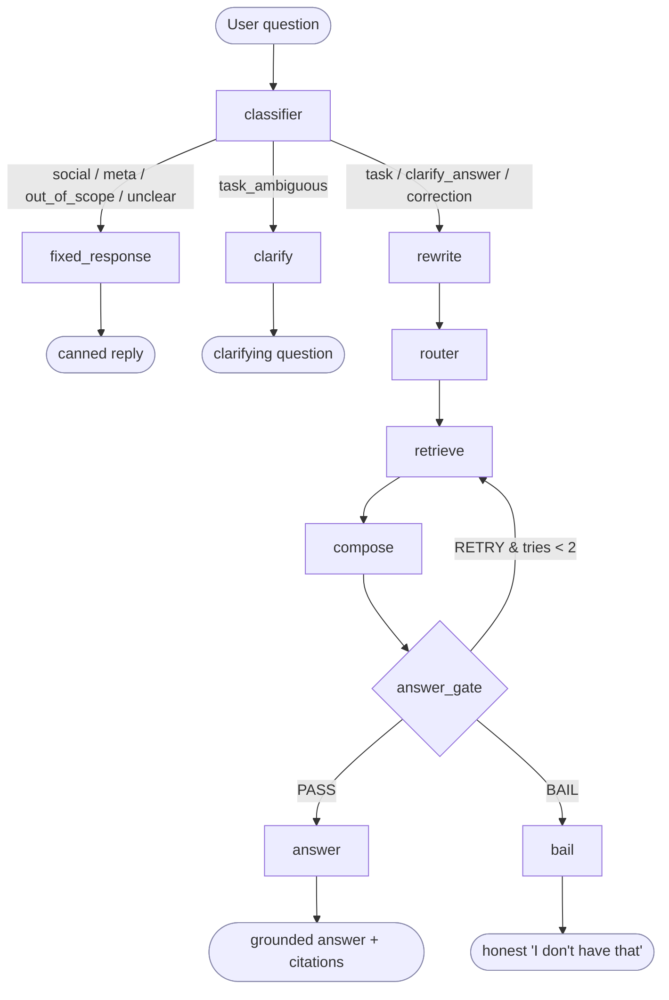
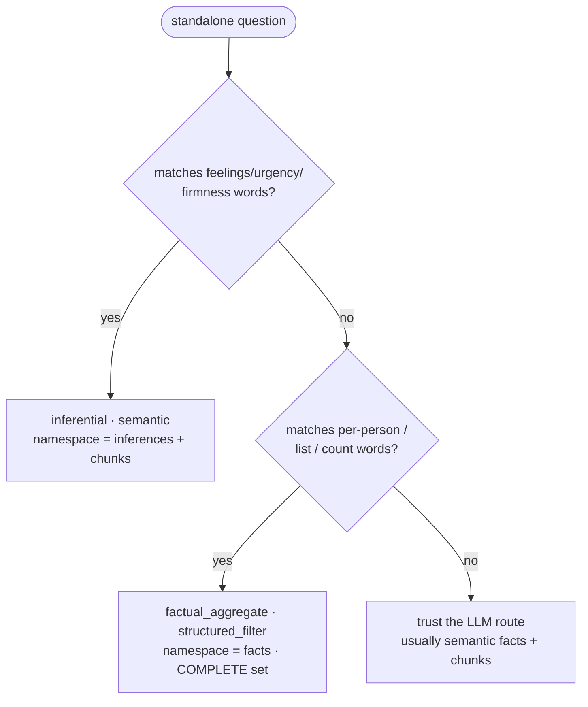
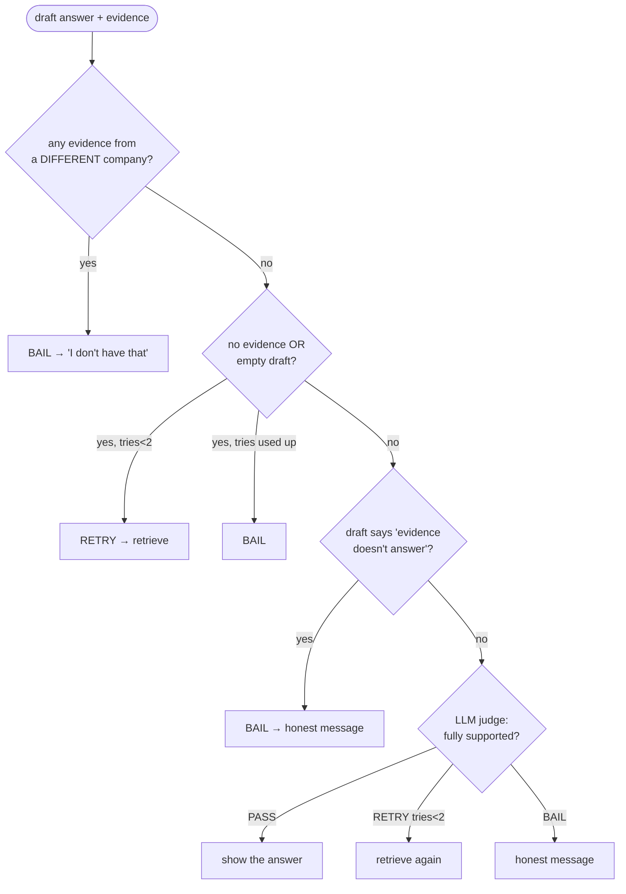

# MinuteMind — How a Question Flows Through the System

A map of what happens between *you typing a question* and *the answer appearing* —
every node, every decision, and **what input sends it down which path**.

Read it two ways:
- **Business view** — the plain-language "front desk" story (Section 1).
- **Technical view** — the real nodes, conditions, and code (Sections 2–5).

---

## 1. Business view (the front-desk analogy)

Think of MinuteMind as a careful assistant at a front desk who **only** knows what was
said in your meetings:

1. **"What kind of message is this?"** — A greeting? A real question? Something off-topic?
   Small talk gets a quick canned reply; off-topic is politely declined; a real question
   moves forward.
2. **"Is the question clear enough?"** — Vague ("what did we decide?") → it asks you to
   clarify. Clear → it proceeds.
3. **"Where do I look?"** — Facts (decisions/tasks)? Feelings (mood/urgency)? A specific
   person's to-dos? It picks the right drawer.
4. **"Pull the evidence."** — It retrieves only your company's records.
5. **"Write the answer — with receipts."** — Every claim gets a citation; soft reads are
   labelled as opinions, not facts.
6. **"Double-check before speaking."** — If the answer isn't fully backed by evidence, it
   **won't guess** — it says "I don't have that," honestly.

The golden rule throughout: **never make anything up, never leak another company's data.**

---

## 2. The whole flow (one diagram)



Same thing in plain ASCII (works in any terminal):

```
            ┌──────────────────────────── user question ───────────────────────────┐
            ▼
       [classifier] ──── social/meta/out_of_scope/unclear ──► [fixed_response] ─► canned reply
            │
            ├──── task_ambiguous ───────────────────────────► [clarify] ──────► "which X do you mean?"
            │
            └──── task/clarify_answer/correction ─► [rewrite] ─► [router] ─► [retrieve] ─► [compose]
                                                                                              │
                                                                                              ▼
                                                                                       {answer_gate}
                                                                  PASS ─► [answer] ─► grounded answer + citations
                                                                  RETRY (tries<2) ─► back to [retrieve]
                                                                  BAIL ─► [bail] ─► "I don't have that"
```

---

## 3. Decision points — what input triggers which path

### 3a. The classifier (the first fork)

The classifier runs **deterministic checks first** (fast, free, reliable), then falls back
to the LLM. Order matters — first match wins.

| # | Check (in `classifier_node`) | Example input | Result → next node |
|---|---|---|---|
| 1 | `_is_social()` — every word is a greeting/closing | "hey", "thanks, that's all" | `social` → **fixed_response** |
| 2 | `_OOS_RE` — world-knowledge patterns | "capital of France?", "weather in NYC" | `out_of_scope` → **fixed_response** |
| 3 | `_prev_assistant_was_clarifying()` — last bot turn was a question | "the database" (after a clarify) | `clarify_answer` → **rewrite** |
| 4 | LLM classifier (with guidance) | everything else | one of the types below |

LLM-produced types and where they go:

| turn_type | Meaning | Goes to |
|---|---|---|
| `task` | answerable from meetings | **rewrite** (→ retrieval) |
| `clarify_answer` | answers a prior clarifying question | **rewrite** |
| `correction` | "no, I meant…" | **rewrite** |
| `task_ambiguous` | a meeting question too vague to retrieve | **clarify** |
| `social` | greeting / thanks / closing | **fixed_response** (GREETING or ENDING) |
| `meta` | "what can you do?" | **fixed_response** (CAPABILITIES) |
| `out_of_scope` | general knowledge | **fixed_response** (OUT_OF_SCOPE) |
| `unclear` | empty / nonsense | **fixed_response** (rephrase prompt) |

> Canned replies for each are defined in [`prompts/fixed_responses.py`](../prompts/fixed_responses.py).

### 3b. The router (which "drawer" to search)

After rewrite produces a standalone question, the router (LLM **+** deterministic nudges
in `router_node`) picks a retrieval mode:



| Question shape | Example | Mode | Searches |
|---|---|---|---|
| feelings / urgency / firmness | "how urgent is this?", "was there tension?" | `semantic` | **inferences** + chunks |
| per-person / list / count | "what does Marcus owe?", "how many action items?" | `structured_filter` | **facts** (complete set) |
| general recall | "what did we decide about the DB?" | `semantic` | facts + chunks |

### 3c. Retrieve (how evidence is pulled)

| Mode | Behaviour (`retrieve_node`) |
|---|---|
| `semantic` / `hybrid` | embed the question → top-k nearest vectors (k = 5 + 3×retry) |
| `structured_filter` | `collection.get()` → the COMPLETE set by metadata, no top-k |

**Always**, in every mode: `company_id` is a hard `where` filter — another tenant's data
can't be retrieved.

### 3d. The answer gate (the safety check before replying)

Checks run in order; first match decides:



| Check (`answer_gate_node`) | If true |
|---|---|
| `_code_isolation_ok` fails (foreign `company_id`) | **BAIL** immediately (hard guarantee) |
| nothing retrieved / empty draft | **RETRY** (if tries < 2) else **BAIL** |
| `_NON_ANSWER_RE` matches the draft ("doesn't answer…") | **BAIL** with the canonical message |
| LLM judge verdict | **PASS** → answer · **RETRY** (<2) → retrieve · **BAIL** |

---

## 4. Node-by-node (input → does what → output)

| Node | Input | What it does | Output |
|---|---|---|---|
| **classifier** | latest turn + history | label the turn (code checks, then LLM) | `turn_type` |
| **fixed_response** | `turn_type` | pick a canned reply | `final_answer` |
| **clarify** | — | ask a disambiguating question | `final_answer` |
| **rewrite** | latest turn + history | resolve references → standalone question | `standalone_question` |
| **router** | standalone question | choose mode + namespace + filters | `route` |
| **retrieve** | route + question | pull evidence (vector or metadata), `company_id`-scoped | `retrieved[]` |
| **compose** | question + evidence | write grounded answer with citations; label inferences | `draft_answer`, `citations` |
| **answer_gate** | draft + evidence | isolation/empty/non-answer checks, then LLM judge | `gate_verdict` (+ `final_answer` on bail) |
| **answer** | draft | finalise the passing answer | `final_answer` |
| **bail** | — | return the honest "no results" reply | `final_answer` |

---

## 5. Worked examples (real paths)

| You ask | Path taken | Why |
|---|---|---|
| **"hey"** | classifier → **fixed_response** | `_is_social` match → `social`; no retrieval |
| **"what's the capital of France?"** | classifier → **fixed_response** | `_OOS_RE` match → `out_of_scope` |
| **"what did we decide?"** | classifier → **clarify** | LLM → `task_ambiguous` (no topic) |
| **"the database"** *(after a clarify)* | classifier → rewrite → router → retrieve → compose → gate(PASS) → **answer** | prior bot turn was a question → `clarify_answer`; rewrite = "what did we decide about the database"; semantic recall → Postgres |
| **"what does Marcus owe?"** | classifier → rewrite → router(*structured_filter*) → retrieve(complete facts) → compose → gate(PASS) → **answer** | per-person nudge → complete fact set |
| **"how urgent is this?"** | classifier → rewrite → router(*inferential*) → retrieve(inferences) → compose → **answer** | feelings/urgency nudge → inferences collection; answer labelled "(inference …)" |
| **"did finance approve the budget?"** | classifier → rewrite → router → retrieve(0) → gate(RETRY×2) → **bail** | nothing in this company's meetings → honest "I don't have that" |

---

## 6. Appendix — how the data got there (ingestion)

Questions only work because a meeting was ingested first. That pipeline is linear, with
early **halts** on bad input:

```
transcript JSON
   → [intake]              valid shape? ── no ──► HALT
   → [validate]            ≥80% segments have a speaker? ── no ──► HALT
   → [speaker_resolution]  normalise speaker labels
   → [analyzer]            LLM extracts decisions / action items / inferences
   → [grounding_gate]      per claim: quote real? + LLM judge supports it?
                           ── fail ──► DROP the claim (not stored)
   → [indexer]             embed + store facts / inferences / chunks (company_id stamped)
```

The grounding gate is why an unprovable claim (e.g. "redo the charts" when someone said
"I *don't* want to redo the charts") never becomes a stored fact.

> Source of truth: [`qna/graph.py`](../qna/graph.py), [`qna/nodes.py`](../qna/nodes.py),
> [`ingest/graph.py`](../ingest/graph.py), [`ingest/nodes.py`](../ingest/nodes.py).
> For a real run with live values, see any [`runs/<meeting_id>/3-agentic-dataflow.md`](../runs/).
